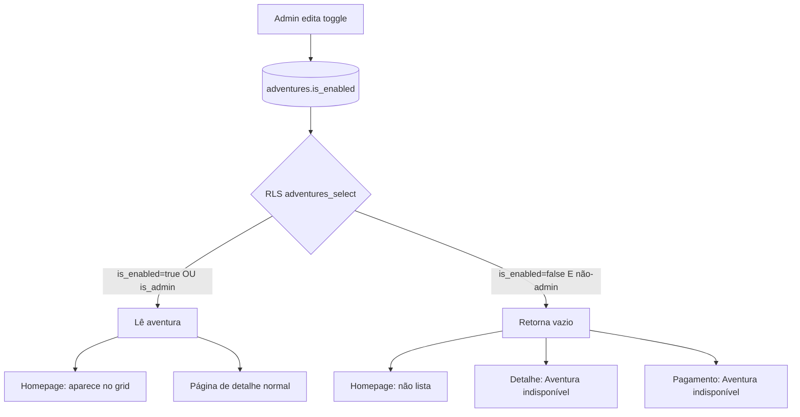

# Visibilidade de aventura (habilitar/desabilitar)

## Visão geral

Adicionar um toggle **"Aventura habilitada"** no formulário admin de criar/editar aventura. Quando desabilitada, a aventura **não aparece na listagem da homepage**, a **página de detalhe** exibe mensagem de indisponibilidade e a **página de pagamento** também fica bloqueada — mesmo para links de inscrição já gerados.

Decisões aprovadas na brainstorm:

| Tópico | Escolha |
|--------|---------|
| Link direto (`/adventures/[slug]`) | Bloqueado — exibe "Aventura indisponível" |
| Link de pagamento pendente | Também bloqueado |
| Padrão em aventuras novas | Habilitada (`is_enabled = true`) |
| Abordagem técnica | Opção 2 — campo booleano + RLS no Supabase |

---

## Problema atual

Todas as aventuras cadastradas aparecem na homepage (`useCollection('adventures')` sem filtro). A política RLS `adventures_select` permite leitura pública de **todas** as linhas (`USING (true)`). Não existe forma de ocultar uma aventura do público sem excluí-la do banco.

O toggle existente **"Habilitar Inscrições"** (`registrations_enabled`) controla apenas o formulário de inscrição na página de detalhe — não afeta a listagem nem bloqueia o acesso à página.

---

## Requisitos funcionais

### Admin — formulário (`/admin/adventures/new` e `/admin/adventures/[id]/edit`)

- Novo toggle **"Aventura habilitada"** no `AdventureForm`, mesmo padrão visual dos toggles existentes (`Switch` em card `rounded-lg border p-4`)
  - Posicionado **antes** de "Habilitar Inscrições" (visibilidade é mais abrangente que inscrições)
  - *Label:* "Aventura habilitada"
  - *Descrição:* "Quando desabilitada, a aventura não aparece no site e fica indisponível para visitantes."
- Valor padrão em aventuras novas: `true` (habilitada)
- Persistido como `is_enabled` no banco ao criar/editar

### Admin — listagem (`/admin/adventures`)

- Novo badge de visibilidade na tabela, independente do badge de inscrições:
  - `is_enabled = true` → **"Ativa"** (`variant="default"`)
  - `is_enabled = false` → **"Desabilitada"** (`variant="outline"` ou `secondary`)
- Admin continua vendo **todas** as aventuras (habilitadas e desabilitadas)

### Homepage (`/`)

- Listagem mostra apenas aventuras habilitadas — garantido pelo RLS, sem filtro adicional no cliente
- Comportamento do empty state existente ("Nenhuma aventura disponível no momento") permanece quando não há aventuras habilitadas

### Página de detalhe (`/adventures/[slug]`)

- Quando a aventura não é retornada pela query (inexistente **ou** desabilitada para o público):
  - **Não** usar `notFound()` (404 genérico)
  - Exibir tela amigável **"Aventura indisponível"** com texto explicativo e botão/link para a homepage
- Componente reutilizável recomendado: `AdventureUnavailable` em `src/app/(main)/adventures/_components/`

### Página de pagamento (`/adventures/[slug]/pagamento`)

- Verificar disponibilidade da aventura **antes** de exibir dados de pagamento
- Se a aventura estiver desabilitada (query retorna vazio por RLS): mesma tela **"Aventura indisponível"**
- Importante: `get_registration_by_token` é `SECURITY DEFINER` e ainda retorna a inscrição — a checagem de visibilidade da aventura deve ser explícita nesta página, não inferida apenas pela ausência de `pix_config`

### O que não muda

- Admin continua editando aventuras desabilitadas normalmente
- Inscrições existentes permanecem em `/admin/registrations` e na exportação XLSX
- `registrations_enabled` continua controlando apenas o formulário de inscrição (independente de `is_enabled`)
- Link "Ver" no admin abre a URL pública — para aventuras desabilitadas, o admin verá a tela de indisponível (comportamento esperado)

---

## Abordagem escolhida

**Opção 2 — campo `is_enabled` + RLS.** Bloqueio real no banco: visitantes anônimos (e usuários não-admin) não conseguem ler aventuras desabilitadas via API Supabase, não apenas via UI.

### Alternativas rejeitadas

| Opção | Motivo de rejeição |
|-------|-------------------|
| Filtro só no frontend | Slug direto e API Supabase continuariam expondo a aventura |
| Status enum (`draft` / `published` / `archived`) | Complexidade desnecessária para o requisito atual (YAGNI) |
| Reutilizar `registrations_enabled` | Semântica diferente; não bloqueia listagem nem página de detalhe |

---

## Modelo de dados

### Migration `015_adventure_visibility.sql`

```sql
-- Visibilidade pública da aventura
ALTER TABLE adventures
  ADD COLUMN is_enabled boolean NOT NULL DEFAULT true;

-- Restringir leitura pública: apenas aventuras habilitadas (admins veem todas)
DROP POLICY IF EXISTS "adventures_select" ON adventures;
CREATE POLICY "adventures_select" ON adventures
  FOR SELECT
  USING (is_enabled = true OR is_admin());
```

- Aventuras existentes: ficam habilitadas automaticamente (`DEFAULT true`)
- Aventuras novas: habilitadas por padrão

### Tipo TypeScript (`src/lib/types.ts`)

```typescript
export type Adventure = {
  // ...campos existentes
  is_enabled: boolean;
  // ...
};
```

---

## UI da tela "Aventura indisponível"

Componente compartilhado (`AdventureUnavailable`):

- Ícone: `Mountain` ou `AlertTriangle` (seguir padrão visual das outras telas de estado em `pagamento/page.tsx`)
- *Título:* "Aventura indisponível"
- *Descrição:* "Esta aventura não está disponível no momento. Confira outras atividades na nossa página inicial."
- *Ação:* botão "Voltar para Home" (`Link href="/"`)
- Layout: `Card` centralizado, consistente com as telas de erro em `pagamento/page.tsx`

---

## Arquivos impactados

| Arquivo | Mudança |
|---------|---------|
| `supabase/migrations/015_adventure_visibility.sql` | Coluna + policy RLS |
| `src/lib/types.ts` | Campo `is_enabled` no tipo `Adventure` |
| `src/app/(admin)/admin/adventures/_components/adventure-form.tsx` | Toggle + schema Zod + persistência |
| `src/app/(admin)/admin/adventures/page.tsx` | Badge de visibilidade |
| `src/app/(main)/adventures/_components/adventure-unavailable.tsx` | Componente novo (tela de indisponível) |
| `src/app/(main)/adventures/[slug]/page.tsx` | Substituir `notFound()` por `AdventureUnavailable` |
| `src/app/(main)/adventures/[slug]/pagamento/page.tsx` | Checagem de visibilidade + tela de indisponível |

A homepage (`page.tsx`) **não precisa de alteração** — o RLS filtra automaticamente.

---

## Fluxo de dados



---

## Verificação manual

1. Criar aventura nova → deve aparecer na homepage (padrão habilitada)
2. Desabilitar aventura no admin → some da homepage em aba anônima
3. Acessar `/adventures/[slug]` da aventura desabilitada → "Aventura indisponível"
4. Acessar link de pagamento pendente da mesma aventura → "Aventura indisponível"
5. Admin em `/admin/adventures` → vê a aventura com badge "Desabilitada"
6. Reabilitar → volta a aparecer na homepage e páginas públicas funcionam
7. `npm run typecheck` e `npm run lint` sem erros

---

## Relação entre toggles

| `is_enabled` | `registrations_enabled` | Comportamento público |
|:---:|:---:|---|
| `false` | qualquer | Oculta da listagem; detalhe e pagamento bloqueados |
| `true` | `false` | Visível na listagem e no detalhe; sem formulário de inscrição |
| `true` | `true` | Visível com inscrições abertas (comportamento atual completo) |
