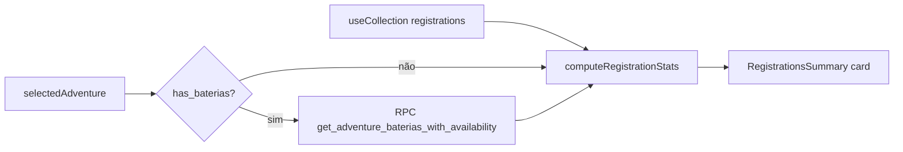

# Resumo de Inscrições por Bateria — Painel Admin

**Data:** 2026-06-11  
**Status:** spec aprovada para implementação  
**Relacionado:** `2026-05-14-baterias-design.md`

---

## Visão geral

Adicionar um card de resumo no topo da página de inscrições do admin (`/admin/registrations`), visível quando uma aventura está selecionada no filtro. O card exibe o total de alunos inscritos, quantos têm pagamento confirmado e, para aventuras com baterias, a distribuição por bateria com ocupação (`inscritos/capacidade`) e confirmados.

Objetivo: eliminar a necessidade de somar manualmente linhas da tabela para saber quantos alunos estão em cada bateria.

---

## Decisões consolidadas

| # | Tópico | Decisão |
|---|--------|---------|
| 1 | Localização | Card no topo da página **Inscrições**, entre cabeçalho e tabela |
| 2 | Visibilidade | Somente quando uma aventura está selecionada no filtro |
| 3 | Total geral | Soma de `group_size` de todas as inscrições da aventura |
| 4 | Confirmados | Soma de `group_size` onde `payment_status === 'confirmed'` |
| 5 | Exibição do total | Dois números: `"12 alunos inscritos (8 confirmados)"` |
| 6 | Por bateria | `"Label (HH:MM–HH:MM): X/capacity · Y confirmados"` |
| 7 | Unidade de contagem | Participantes individuais (`principal` + cada item de `participants[]` em `bateria_assignments`), não grupos |
| 8 | Aventura sem baterias | Card mostra apenas totais gerais; se `max_participants` existir, exibir `"12/50 alunos inscritos (8 confirmados)"` |
| 9 | Abordagem técnica | Agregação no cliente a partir de inscrições já carregadas + metadados de baterias via RPC existente |
| 10 | Atualização | Automática via `useCollection` (realtime), sem polling extra |

---

## Fora do escopo

- Resumo no dashboard admin
- Resumo no formulário de edição da aventura
- Filtro da tabela por bateria
- Mover inscrição entre baterias
- Nova RPC ou migração SQL
- Exportação XLSX alterada (continua como está)

---

## Problema atual

A página [`src/app/(admin)/admin/registrations/page.tsx`](../../../src/app/(admin)/admin/registrations/page.tsx) lista inscrições com uma coluna **Baterias** que resume por linha (ex.: `Manhã (2), Tarde (1)`), mas não oferece visão agregada.

Para saber quantos alunos estão em cada bateria, o admin precisa percorrer todas as linhas e somar manualmente. A RPC `get_adventure_baterias_with_availability` já retorna `reserved` por bateria, porém:

1. Não distingue pagamentos confirmados de pendentes
2. Não é usada na página de inscrições
3. O total geral de alunos também não aparece em destaque

---

## Abordagem escolhida

**Agregação no cliente (Abordagem 1)**

Calcular estatísticas a partir das inscrições já carregadas por `useCollection<Registration>('registrations')` e buscar metadados das baterias (label, horários, capacidade, sort_order) via RPC existente `get_adventure_baterias_with_availability`.

Motivos:

- Sem migração SQL ou nova RPC
- Dados de inscrições já estão em memória com status de pagamento
- Consistência entre totais gerais e totais por bateria (mesma fonte)
- Atualização em tempo real herdada do `useCollection`

A RPC `reserved` **não** será usada para exibição — os números por bateria serão calculados iterando `bateria_assignments` de cada inscrição filtrada.

---

## Requisitos funcionais

### Card de resumo

Quando `selectedAdventureId !== ""`:

1. Renderizar card entre `CardHeader` e `CardContent` (tabela)
2. Título: `"Resumo: {adventure.title}"`
3. Linha de totais:
   - Com baterias: `"12 alunos inscritos (8 confirmados)"`
   - Sem baterias e com `max_participants`: `"12/50 alunos inscritos (8 confirmados)"`
   - Sem baterias e sem `max_participants`: `"12 alunos inscritos (8 confirmados)"`
4. Se `adventure.has_baterias === true`, listar cada bateria ordenada por `sort_order`:
   - Formato: `{label} ({start_time}–{end_time}): {total}/{capacity} · {confirmed} confirmados`
   - Horários formatados como `HH:MM` (sem segundos)
5. Se a aventura tem baterias mas nenhuma inscrição tem `bateria_assignments`, exibir baterias com `0/capacity · 0 confirmados`

Quando nenhuma aventura está selecionada, o card **não** aparece.

### Regras de contagem

**Total geral (`totalStudents`):**

```
sum(reg.group_size) for reg in filteredRegistrations
```

**Confirmados (`confirmedStudents`):**

```
sum(reg.group_size) for reg in filteredRegistrations where reg.payment_status === 'confirmed'
```

**Por bateria (`totalPerBateria`, `confirmedPerBateria`):**

Para cada inscrição com `bateria_assignments`:

1. Coletar IDs: `[principal, ...participants]`
2. Para cada ID, incrementar `totalPerBateria[id]`
3. Se `payment_status === 'confirmed'`, incrementar também `confirmedPerBateria[id]`

Inscrições sem `bateria_assignments` (aventura com baterias, dado legado) não entram na contagem por bateria, mas continuam no total geral.

**Capacidade por bateria:** vem de `get_adventure_baterias_with_availability` (campo `capacity`).

---

## Componentes e arquivos

### Novo: `src/app/(admin)/admin/registrations/_lib/registration-stats.ts`

Funções puras exportadas:

```typescript
type BateriaStats = {
  id: string;
  label: string;
  startTime: string;
  endTime: string;
  capacity: number;
  sortOrder: number;
  total: number;
  confirmed: number;
};

type RegistrationSummaryStats = {
  totalStudents: number;
  confirmedStudents: number;
  maxParticipants: number | null;
  hasBaterias: boolean;
  baterias: BateriaStats[];
};

function computeRegistrationStats(
  registrations: Registration[],
  adventure: Adventure,
  baterias: BateriaAvailability[],
): RegistrationSummaryStats;
```

Responsabilidades:

- Filtrar/agregar inscrições
- Mapear baterias com contadores zerados quando não há inscrições
- Formatação de horário fica no componente (não na lib)

### Novo: `src/app/(admin)/admin/registrations/_components/registrations-summary.tsx`

Props:

```typescript
type RegistrationsSummaryProps = {
  adventure: Adventure;
  registrations: Registration[];
};
```

Comportamento interno:

- `useEffect` carrega baterias via RPC quando `adventure.has_baterias`
- Chama `computeRegistrationStats`
- Renderiza card com shadcn `Card` ou bloco visual consistente com o admin existente
- Estado de loading: skeleton ou spinner compacto enquanto carrega baterias

### Alteração: `src/app/(admin)/admin/registrations/page.tsx`

- Importar e renderizar `<RegistrationsSummary />` condicionalmente quando `selectedAdventure` existir
- Passar `filteredRegistrations` (inscrições da aventura selecionada) e `selectedAdventure`

---

## Layout proposto

```
┌─ Resumo: Trilha do Pico ──────────────────────────────────┐
│  👥 12 alunos inscritos (8 confirmados)                   │
│                                                           │
│  Manhã (08:00–10:00)        5/20  ·  3 confirmados        │
│  Tarde (14:00–16:00)        7/15  ·  5 confirmados        │
└───────────────────────────────────────────────────────────┘
```

Aventura sem baterias:

```
┌─ Resumo: Caminhada Noturna ────────────────────────────────┐
│  👥 12/50 alunos inscritos (8 confirmados)                 │
└───────────────────────────────────────────────────────────┘
```

Usar ícone `Users` (lucide-react), tipografia e espaçamento alinhados aos cards do dashboard admin.

---

## Fluxo de dados



---

## Tratamento de erros

| Cenário | Comportamento |
|---------|---------------|
| RPC de baterias falha | Card exibe totais gerais; seção de baterias mostra mensagem `"Não foi possível carregar baterias."` |
| Aventura sem inscrições | Card com zeros: `"0 alunos inscritos (0 confirmados)"` e baterias `0/capacity` |
| Inscrição legada sem `bateria_assignments` | Conta no total geral; ignorada na distribuição por bateria |

---

## Verificação manual

1. Selecionar aventura **com baterias** e inscrições → card mostra totais corretos e breakdown por bateria
2. Confirmar pagamento de uma inscrição → contagem de confirmados atualiza em tempo real
3. Selecionar aventura **sem baterias** → card mostra só totais (com `max_participants` se existir)
4. Limpar filtro → card desaparece
5. Aventura com baterias mas zero inscrições → card com zeros
6. `npm run typecheck` e `npm run lint` passam

---

## Alternativas descartadas

| Abordagem | Motivo da rejeição |
|-----------|-------------------|
| Nova RPC `get_adventure_registration_stats` | Over-engineering; dados já disponíveis no cliente |
| Usar `reserved` da RPC existente | Não separa confirmados de pendentes |
| Resumo no dashboard | Fora do recorte aprovado pelo usuário |
| Resumo no formulário da aventura | Fora do recorte aprovado pelo usuário |
