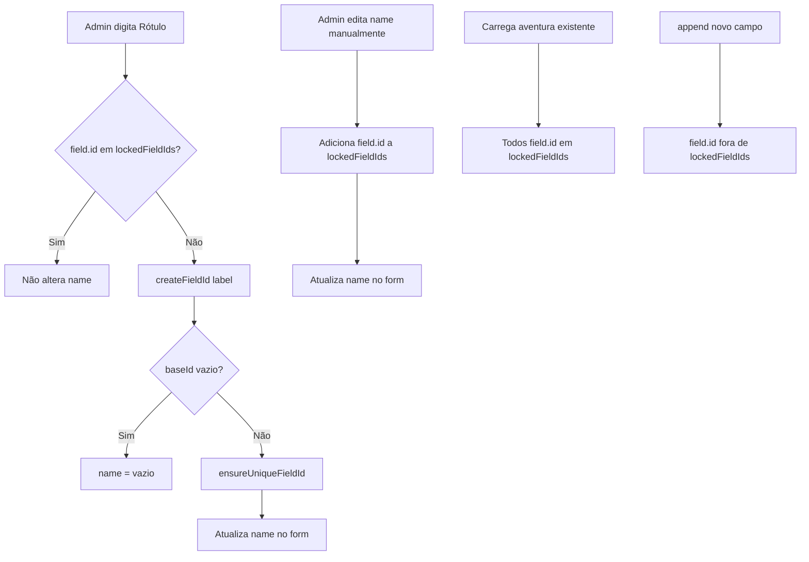

# Auto-preenchimento do ID de campos personalizados

## Visão geral

No construtor de formulário de inscrição (`/admin/adventures`), ao criar campos personalizados, o campo **Nome do Campo (ID)** (`name`) deve ser preenchido automaticamente a partir do **Rótulo do Campo** (`label`), mas permanecer editável. Se o usuário editar o ID manualmente, a sincronização automática para de ocorrer para aquele campo. IDs gerados automaticamente não podem colidir com outros campos do mesmo formulário — em caso de duplicata, adicionar sufixo numérico (`nome_2`, `nome_3`, …).

Decisões aprovadas na brainstorm:

| Tópico | Escolha |
|--------|---------|
| Comportamento após edição manual do ID | Opção A — ID trava e não é mais atualizado pelo rótulo |
| Colisão de IDs | Sufixo numérico com underscore (`nome_2`, `nome_3`) |
| Campos já salvos na aventura | ID nasce travado ao carregar — protege inscrições existentes |
| Formato do ID | Manter validação atual `^[a-z0-9_]+$` (sem hífens) |

---

## Problema atual

No `adventure-form.tsx`, os campos **Rótulo** e **Nome (ID)** são independentes. O admin precisa digitar o ID manualmente em snake_case, mesmo quando o rótulo já sugere um identificador óbvio (ex.: rótulo "CPF" → ID `cpf`).

Já existe padrão similar no `content-page-form.tsx` (título → slug), mas lá o slug é sempre sobrescrito e não respeita edição manual — comportamento inadequado para este caso.

O `name` é a chave usada em `registrations.custom_data` e `participants[].*`. Alterar o ID de um campo já utilizado em inscrições quebraria o vínculo com dados históricos.

---

## Requisitos funcionais

### Auto-preenchimento (campos novos)

- Ao adicionar um campo personalizado (`append`), o ID inicia vazio e desbloqueado
- Conforme o admin digita o rótulo, o ID é gerado automaticamente em tempo real
- Se o rótulo ficar vazio, o ID também fica vazio
- O campo ID permanece editável a qualquer momento

### Travamento manual (opção A)

- Se o admin editar o campo **Nome do Campo (ID)** manualmente, aquele campo passa a ter o ID **travado**
- Enquanto travado, mudanças no rótulo **não** alteram o ID
- Não há botão de "ressincronizar" nesta versão

### Campos carregados do banco (edição de aventura)

- Campos `custom_fields` já persistidos na aventura têm o ID **travado desde o carregamento**
- Alterar o rótulo de um campo existente **não** altera o ID
- Isso protege inscrições que referenciam o ID antigo em `custom_data`

### Deduplicação automática

- Ao gerar o ID automaticamente, verificar os `name` dos demais campos do formulário
- Se o ID base já existir, acrescentar sufixo `_2`, `_3`, etc., até encontrar um ID livre
- Exemplos:
  - primeiro campo com rótulo "Nome" → `nome`
  - segundo campo com rótulo "Nome" → `nome_2`
  - terceiro → `nome_3`
- A deduplicação aplica-se **somente** na geração automática
- Se o admin digitar manualmente um ID duplicado, a validação existente no submit continua impedindo o salvamento

### Geração do ID a partir do rótulo

Transformação em snake_case compatível com `^[a-z0-9_]+$`:

1. Converter para minúsculas
2. Remover acentos (`normalize("NFD")` + strip de diacríticos)
3. Substituir espaços e sequências de não-alfanuméricos por `_`
4. Remover `_` no início e no fim
5. Colapsar `_` consecutivos

| Rótulo | ID gerado |
|--------|-----------|
| `CPF` | `cpf` |
| `Número do RG` | `numero_do_rg` |
| `Tamanho de camiseta` | `tamanho_de_camiseta` |

> **Nota:** hífens não são permitidos pela validação atual. Sufixos de colisão usam underscore (`nome_2`), não `nome-2`.

---

## Abordagem escolhida

**`onChange` no rótulo + flag de travamento por campo** (via `field.id` estável do `useFieldArray`).

### Motivos

- Comportamento previsível sem `useEffect` reativo
- `field.id` do React Hook Form sobrevive a reordenações e remoções de outros campos
- Escopo mínimo: alterações concentradas em `adventure-form.tsx`

### Alternativas descartadas

| Abordagem | Motivo da rejeição |
|-----------|-------------------|
| `useEffect` observando rótulo | Mais frágil; risco de atualizações indesejadas |
| Botão "Gerar ID" | Não atende ao requisito de preenchimento automático |
| Sempre sobrescrever ID (como slug de páginas) | Ignora edição manual do usuário |

---

## Arquitetura e componentes

### Arquivo principal

`src/app/(admin)/admin/adventures/_components/adventure-form.tsx`

### Novas funções utilitárias (no mesmo arquivo ou extraídas se já houver padrão)

```ts
function createFieldId(label: string): string
function ensureUniqueFieldId(baseId: string, allNames: string[], currentIndex: number): string
```

- `createFieldId` — normaliza rótulo para ID válido; retorna `""` se rótulo vazio ou só caracteres inválidos
- `ensureUniqueFieldId` — compara com `name` dos outros índices do array; retorna primeiro ID livre com sufixo `_N` se necessário

### Estado de travamento

```ts
const [lockedFieldIds, setLockedFieldIds] = useState<Set<string>>(() => new Set())
```

- **Ao montar com aventura existente:** popular `lockedFieldIds` com os `field.id` de todos os campos carregados de `adventure.custom_fields`
- **Ao `append` novo campo:** não adicionar ao set (desbloqueado)
- **Ao editar manualmente o input de `name`:** adicionar `fields[index].id` ao set
- **Ao remover campo:** opcionalmente remover do set (limpeza; sem impacto funcional crítico)

### Handlers

```ts
function handleCustomFieldLabelChange(index: number, label: string): void
function handleCustomFieldNameChange(index: number, name: string): void
```

**`handleCustomFieldLabelChange`:**

1. Atualizar `label` no formulário
2. Se `fields[index].id` estiver em `lockedFieldIds`, retornar sem alterar `name`
3. Gerar `baseId = createFieldId(label)`
4. Se `baseId` vazio, setar `name` como `""`
5. Caso contrário, `name = ensureUniqueFieldId(baseId, allNames, index)` e setar com `shouldValidate: true`

**`handleCustomFieldNameChange`:**

1. Adicionar `fields[index].id` a `lockedFieldIds`
2. Atualizar `name` no formulário

### Integração na UI

- Campo **Rótulo:** `onChange` chama `handleCustomFieldLabelChange` em vez de repassar direto ao `field.onChange`
- Campo **Nome (ID):** `onChange` chama `handleCustomFieldNameChange`
- Adicionar `FormDescription` opcional sob o ID:
  > *"Preenchido automaticamente a partir do rótulo. Edite se quiser um identificador diferente."*

### Interação com tipo `tshirt_size`

O handler existente `handleCustomFieldTypeChange` já pré-preenche o rótulo com "Tamanho de camiseta" quando o tipo é selecionado. Após esta mudança, se o campo for novo e o ID não estiver travado, o ID deve ser gerado automaticamente (`tamanho_de_camiseta` ou variante deduplicada). Garantir que a pré-definição do rótulo dispare a mesma lógica de geração de ID.

---

## Fluxo de dados



---

## Validação e erros

- Manter schema Zod existente: `name` obrigatório, regex `^[a-z0-9_]+$`
- Deduplicação automática evita colisões na geração; colisão manual continua bloqueada no submit
- Nenhuma migration de banco necessária — alteração apenas na camada de UI/admin

---

## Escopo fora desta entrega

- Botão "Ressincronizar com rótulo" (opção C)
- Alterar validação para aceitar hífens no ID
- Renomear IDs de campos já usados em inscrições (migração de dados)
- Extrair `createFieldId` para lib compartilhada (só se surgir segundo uso)

---

## Verificação manual

1. **Campo novo:** digitar rótulo "CPF" → ID vira `cpf` automaticamente
2. **Edição manual:** alterar ID para `documento` → mudar rótulo → ID permanece `documento`
3. **Deduplicação:** dois campos com rótulo "Nome" → `nome` e `nome_2`
4. **Acentos:** rótulo "Número do RG" → `numero_do_rg`
5. **Campo existente:** editar aventura salva, mudar rótulo de campo antigo → ID não muda
6. **Tamanho de camiseta:** selecionar tipo em campo novo → rótulo e ID preenchidos automaticamente
7. **Submit:** salvar aventura com campos gerados e confirmar que o formulário público usa os IDs corretos
